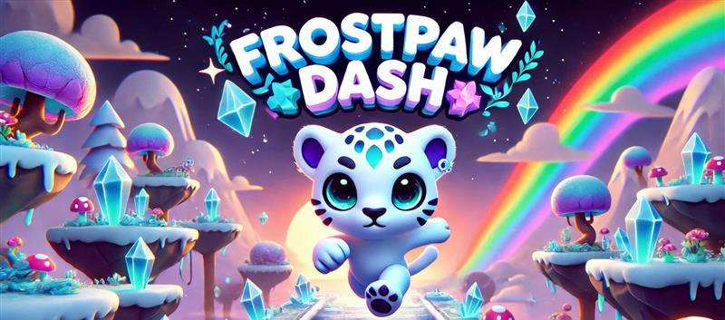

# **Frostpaw Dash**  

  

## **Overview**  
**Frostpaw Dash** is an endless runner 3D game inspired by *Temple Run*, developed in **Unity Engine 6**. Players take control of a **chibi white leopard**, dashing through a stylized fantasy world filled with obstacles, power-ups, and high-speed challenges. The game features vibrant environments, smooth controls, and an immersive experience designed for endless fun.  

## **Game Features (Planned)**  
- 🎮 **Infinite Runner Mechanics** – Procedurally generated levels for endless replayability.  
- 🏃 **Smooth & Responsive Controls** – Swipe or tilt-based movement for intuitive gameplay.  
- ⚡ **Power-ups & Collectibles** – Speed boosts, shields, and double jumps to enhance the run.  
- ⚠️ **Obstacles & Challenges** – Increasing difficulty with dynamic hazards.  
- 🏆 **High Score & Leaderboards** – Compete with personal bests and friends.  
- 🎨 **Stylized Fantasy Aesthetic** – Beautifully crafted environments with an anime-inspired look.  
- 🐆 **Chibi White Leopard Character** – Fully animated and rigged for fluid movement.  

## **Development Roadmap**  
### ✅ **Current Progress**  
- Selected **chibi white leopard** as the main character.  
- Implemented **basic movement mechanics**.  
- Set up **Unity Engine 6** environment.  
- Integrated **stylized assets** for visuals.  

  

## **Assets Used**  
- 🎨 [50 Free Stylized Materials](https://assetstore.unity.com/packages/2d/textures-materials/50-free-stylized-materials-242764) – Stylized textures  
- ☁️ [Free Stylized Skybox](https://assetstore.unity.com/packages/2d/textures-materials/sky/free-stylized-skybox-212257) – Skybox for background  

## **Tech Stack**  
- 🛠 **Engine**: Unity Engine 6  
- 💻 **Language**: C#  
- 📱 **Platform**: PC & Android  

## **How to Run the Game**  
1. Clone the repository:  
   ```sh
   git clone https://github.com/your-username/your-repo.git
   ```
2. Open the project in Unity Engine 6.  
3. Click **Play** to test the game.  

## **License**  
MIT License  
