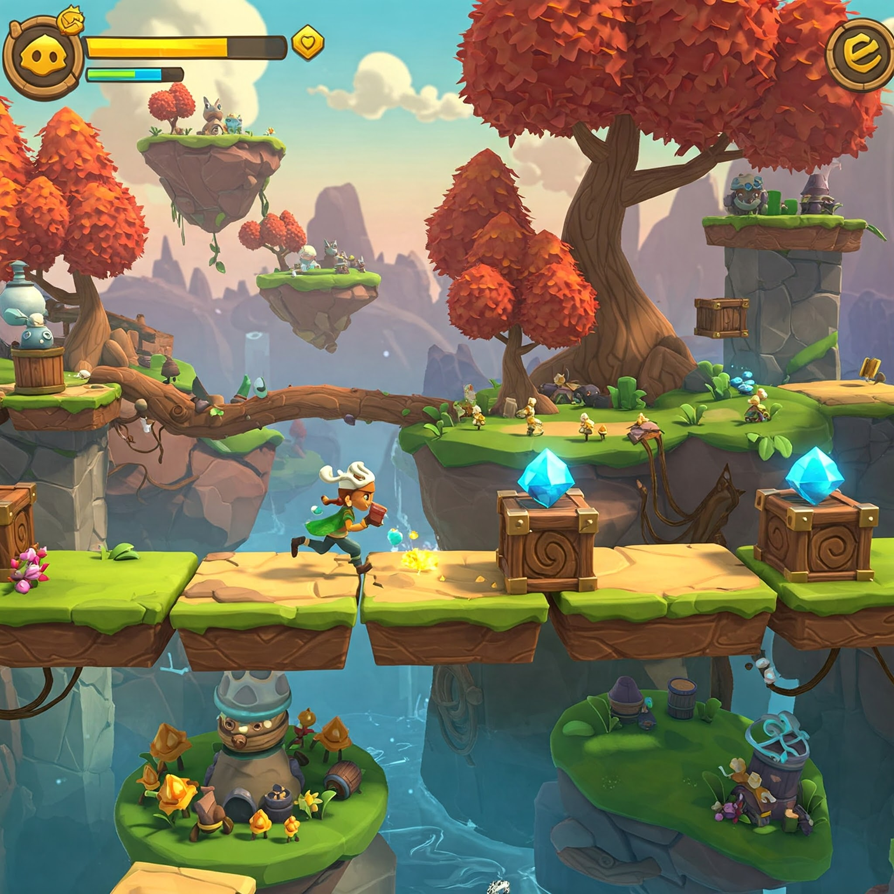

# InfiniteRunner3D

Source code for a tutorial/sample game/starter kit about creating an infinite 3D runner game in Unity (like Temple Run, Subway Surfers).

## **Project Enhancements & Refactor**
This project has been updated to improve performance, maintainability, and scalability. The following changes have been implemented:

### **Implemented Features**
- **Object Pooling:** Improved performance by reusing objects instead of instantiating and destroying them frequently.
- **Modularized Code Structure:** Separated game mechanics into independent components for better maintainability.
- **Upgraded to URP (Universal Render Pipeline):** Enhanced graphics quality and rendering performance.
- **Improved UI & Navigation:** Updated user interface with responsive layouts and intuitive menu navigation.

### **Future Enhancements**
- **Power-Up System:** Add dynamic power-ups that affect player abilities.
- **Level Progression System:** Introduce increasing difficulty and new level challenges.

## **Original Tutorial Links**
- Part 1: [Creating an Infinite 3D Runner Game in Unity - Part 1](http://dgkanatsios.com/2016/03/07/creating-an-infinite-3d-runner-game-in-unity-like-temple-run-subway-surfers-part-1/)
- Part 2: [Creating an Infinite 3D Runner Game in Unity - Part 2](http://dgkanatsios.com/2016/03/09/creating-an-infinite-3d-runner-game-in-unity-like-temple-run-subway-surfers-part-2/)

## **Various Assets Used in the Game**
- **All Sorts Candy:** [Unity Asset Store](https://www.assetstore.unity3d.com/en/#!/content/12512)
- **Max Adventure Model:** [Unity Asset Store](https://www.assetstore.unity3d.com/en/#!/content/3012) *(Referred to as “Max” in the project)*
- **Campfire Pack:** [Unity Asset Store](https://www.assetstore.unity3d.com/en/#!/content/11256)
